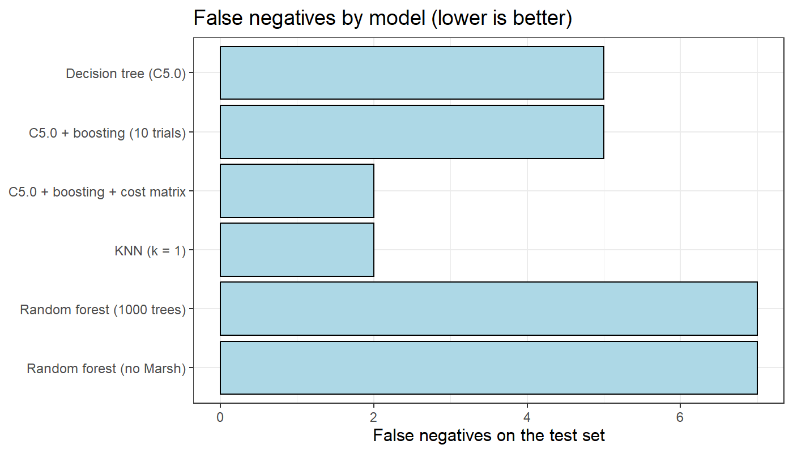
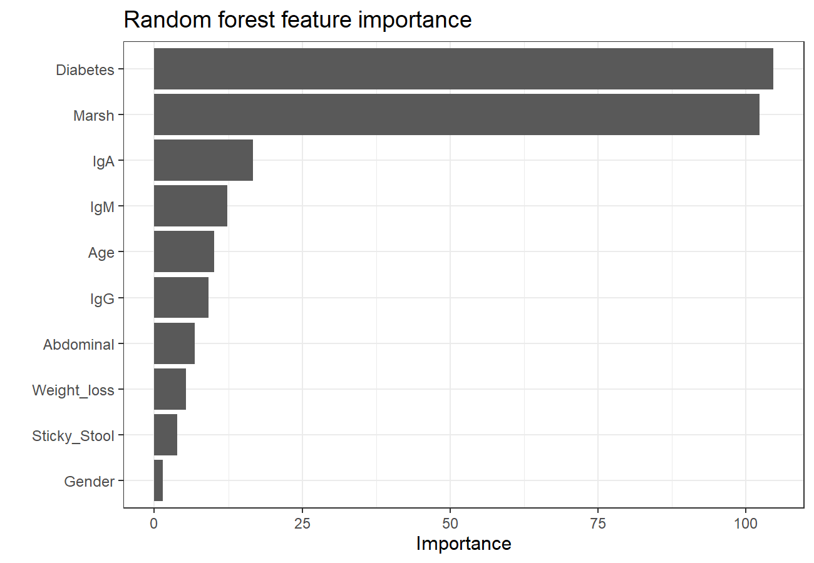
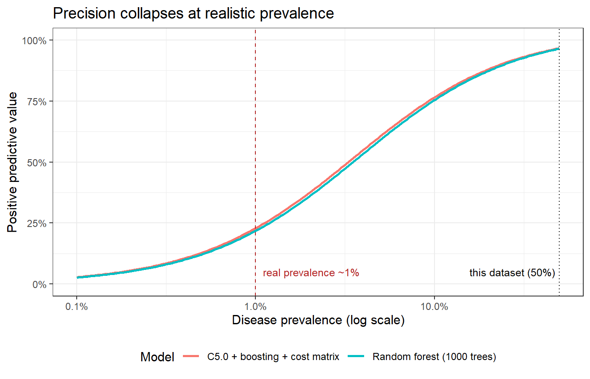
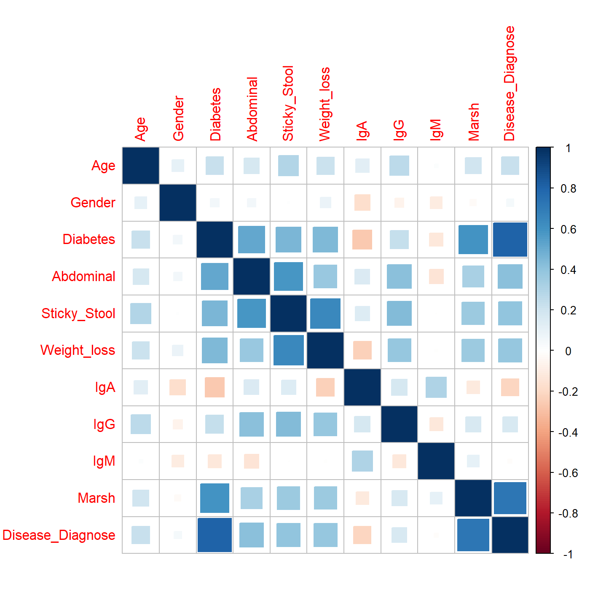

# Celiac Disease Lab Data — EDA and Modeling

Exploratory analysis and supervised classification of laboratory and clinical data related to celiac disease,
in R.

The goal is to understand the data, look for patterns, and build models that predict whether a patient is
diagnosed with celiac disease from lab measurements and symptoms. Particular attention is paid to **false
negatives**, since a missed diagnosis delays treatment and risks long-term complications.

📄 **[Read the full report →](celiac_project.md)**

---

## Results

All models use the **same train/test split** (581 train / 145 test) and the **same ten predictors**.
Hyperparameters are chosen by **repeated 10-fold cross-validation on the training set** (50 resamples); the test
set is evaluated exactly once.

| Model | Accuracy | Sensitivity | False negatives | False positives |
|---|---|---|---|---|
| Decision tree (C5.0) | 95.2% | 0.941 | 5 | 2 |
| C5.0 + boosting (10 trials) | 94.5% | 0.941 | 5 | 3 |
| **C5.0 + boosting + cost matrix (10:1)** | **97.2%** | **0.976** | **2** | 2 |
| **KNN (k = 1)** | **97.2%** | **0.976** | **2** | 2 |
| Random forest (1000 trees) | 93.8% | 0.918 | 7 | 2 |
| Random forest, `Marsh` removed | 90.3% | 0.918 | 7 | 7 |

The cost-sensitive tree and tuned KNN tie at the top. **But McNemar's test says none of these differences are
statistically significant** (best p ≈ 0.07) — with 145 patients, this test set cannot separate the leading
models. The ranking is provisional, and the report says so rather than crowning a winner.



---

## Three findings worth flagging

**1. `Marsh` partly leaks the target.** The Marsh score is the histological grading clinicians use to *make* the
celiac diagnosis, so a model built on it is close to predicting the label from the label. It dominates feature
importance by a wide margin. Removing it costs the forest about three and a half points of accuracy
(93.8% → 90.3%) and more than triples its false positives (2 → 7), while leaving sensitivity *unchanged* at
0.918 — the damage is entirely to specificity. The last row of the table is the more honest estimate of what the
remaining lab values and symptoms predict on their own.



**2. At realistic prevalence, precision collapses.** This dataset is 50% celiac by construction; the real base
rate is about 1%. Sensitivity and specificity don't depend on prevalence, but precision does — so the models
can be projected onto a realistic population directly:

| Prevalence | Precision (PPV) | NPV |
|---|---|---|
| 50% (this dataset) | 96.7% | 97.6% |
| 5% | 60.7% | 99.9% |
| **1% (realistic)** | **22.8%** | **~100%** |
| 0.5% | 12.8% | ~100% |



At a 1% base rate, roughly **three in four positive predictions would be false alarms** — despite 97% accuracy
on the balanced sample. Meanwhile a "predict everyone healthy" model scores 99% accuracy and finds nobody,
which is why accuracy is the wrong headline. NPV stays near 100%, so the honest description is a **rule-out
screening test**, not a diagnostic one.

**3. A cost matrix fails silently if transposed.** `C5.0()` indexes costs as `[actual, predicted]`, but several
textbook examples label the dimensions the other way round. Because the dimension names are cosmetic, a
transposed matrix still runs — it just penalises false *positives* while appearing to penalise false negatives.
Here the transposed version pushed false negatives from 5 up to 9; corrected, they fall.

---

## What the analysis does

- Exploratory data analysis — distributions, missingness, variable types
- Data cleaning and feature encoding (Marsh scores to numeric, symptoms to 0/1)
- Correlation analysis
- Dimensionality reduction with PCA (scaled; PC1 32.7%, PC2 15.6% of variance)
- Supervised classification: decision tree (C5.0, plain / boosted / cost-sensitive), KNN, random forest
- **Hyperparameter tuning by repeated 10-fold cross-validation**, with the scaler refitted inside every fold so
  leakage is structurally impossible
- Evaluation by confusion matrix, accuracy, sensitivity, ROC/AUC, and feature importance
- **Significance testing** of model differences with McNemar's test
- **Predictive value projected across disease prevalence**



---

## Repository layout

```
├── data/
│   └── README.md             # source, column dictionary, preparation steps
│                             # (the CSV itself is gitignored -- see below)
├── figures/                  # plots rendered by the report
├── celiac_project.Rmd        # the analysis
├── celiac_project.md         # rendered report (viewable on GitHub)
├── celiac_project.html       # rendered report (styled, for local viewing)
└── LICENSE
```

## Running it

**To read the results, you don't need to run anything** — [`celiac_project.md`](celiac_project.md) contains
every figure, table, and confusion matrix.

To re-run the analysis you need R (developed on 4.3.0), pandoc (RStudio bundles one), and the dataset. The
dataset is **not** in this repository: its Kaggle source carries an "Unknown" license, which grants no
redistribution rights. Download it and prepare it per [`data/README.md`](data/README.md) — one short script —
then:

```r
install.packages(c("rmarkdown", "tidyverse", "tidymodels", "C50", "gmodels",
                   "corrplot", "class", "ranger", "vip"))

rmarkdown::render("celiac_project.Rmd", output_format = "all")
```

---

## Data

**Celiac Disease Lab Data** — <https://www.kaggle.com/datasets/jackwin07/celiac-disease-coeliac-disease>

The original dataset was shuffled and subsampled to an equal number of diagnosed and non-diagnosed patients
(363 each, n = 726). See [`data/README.md`](data/README.md) for the column dictionary and the exact preparation
steps.

The CSV is deliberately **not committed**. The Kaggle dataset is published under an "Unknown" license, so no
redistribution rights were granted — redistributing it, even in derived form, would not be legitimate.

## Limitations

- **Target leakage** — `Marsh` is part of how the diagnosis is made; see above.
- **Small test set** — 145 patients, and McNemar's test confirms it cannot separate the leading models. The
  ranking is provisional.
- **Artificially balanced sample** — n = 726 at 50/50, so headline accuracy does not transfer to a screening
  population; see the prevalence section for what it becomes at a realistic base rate.
- **Inconsistent selection criteria** — `k` and `mtry` are tuned on accuracy while the cost ratio is tuned on
  false negatives. A single explicit clinical objective would be more coherent.
- **Not nested** — tuning and final fitting share a training set, so the estimate is still mildly optimistic.
- **No external validation** on an independent cohort.

This is a learning and exploration exercise. The models are not intended for clinical use.

## Next steps

- Nested cross-validation, so the estimate is not conditioned on a single outer split
- A single explicit objective (expected cost, or sensitivity at fixed specificity) for all hyperparameters
- Decision-threshold analysis on predicted probabilities — a full precision–recall trade-off curve
- One-hot encode `Diarrhoea` and `Short_Stature` so they can be used without breaking KNN
- Investigate whether different symptoms correlate with different celiac subtypes
- Unsupervised clustering, to see whether the data splits into more than two groups without the labels
- External validation on an independent dataset

## License

Code and documentation are MIT licensed — see [LICENSE](LICENSE). The dataset is subject to its own terms; see
[`data/README.md`](data/README.md).
